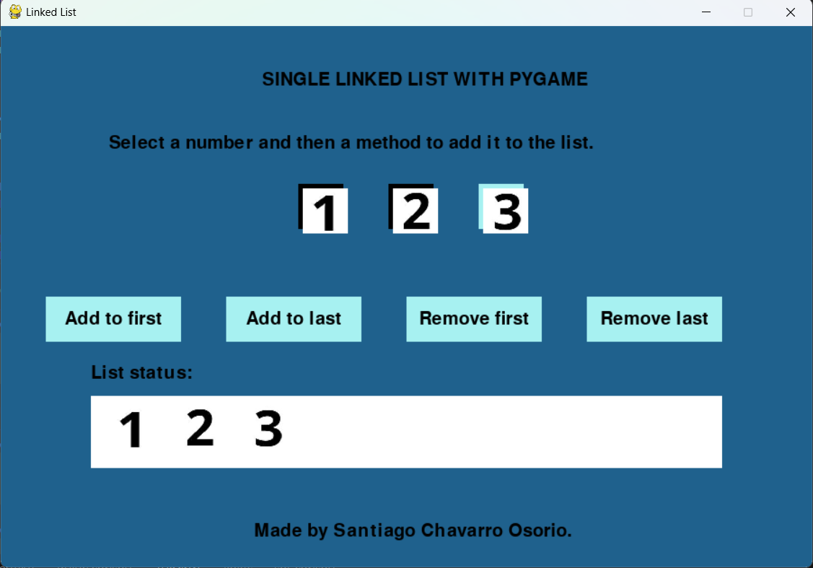

# Single Linked List Pygame

This project is an implementation of a **single linked list** visualized in real-time using **Pygame**. The purpose of this project is to demonstrate the use of data structures in a graphical environment, making it easier to understand linked list concepts.

## Features

- **Graphical Visualization**: Each node is visually represented with connections showing the order in the linked list.
- **Interactive Interface**: Easily add, remove, and view nodes with Pygame, providing an intuitive way to interact with the data structure.
- **Python and Pygame**: Python for core functionality and Pygame for visual representation.



## Requirements

- Python 3.13 or higher
- Pygame 2.6.1

## Technical Instructions

### Setting Up the Environment

1. **Create and activate the Python virtual environment**

````bash
   python -m venv venv
   .\venv\Scripts\Activate

2.  **Install dependencies**

```bash
    pip install -r requirements.txt
````
